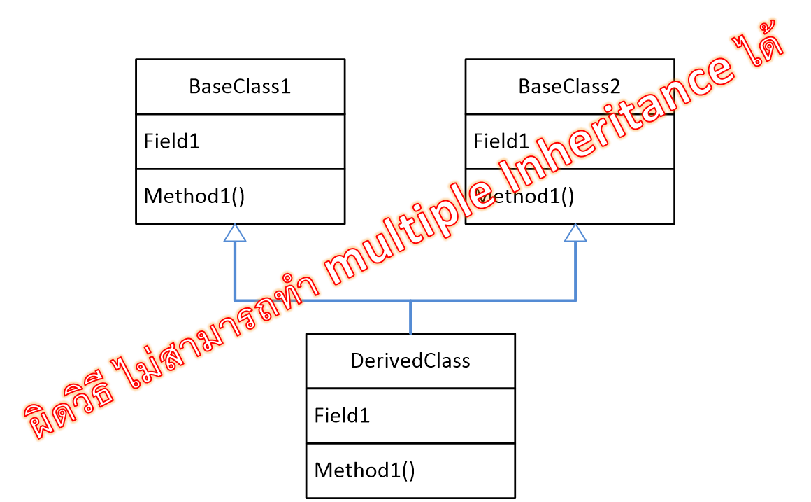
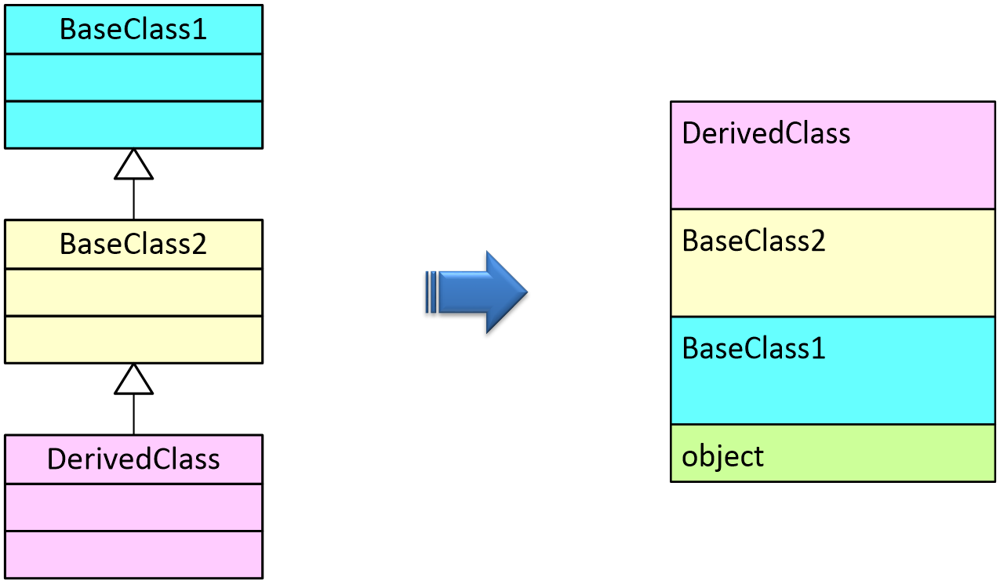

Class Inheritance 

Inheritance

Inheritance ทำให้เราสามารถสร้าง class ใหม่ เพื่อขยายความสามารถของคลาสที่มีอยู่ โดยใช้คลาสที่มีอยู่เป็น Base class
เมื่อทำการ inheritance มาแล้ว จะได้คลาสที่เรียกว่า Derived class
ใน Derived class สามารถเข้าถึงสมาชิกได้ทั้งของ Base class และของตัวมันเอง : ขึ้นอยู่กับการกำหนดระดับการเข้าถึง (access level) ใน base class ด้วย

อาจพูดได้ว่า derived class คือส่วนขยายของ base class
อย่างไรก็ตาม derived class ไม่สามารถขจัดสิ่งที่ base class นิยามไว้

UML DIAGRAM

Conceptual Diagram

Accessing the Inherited Members 

ทุกๆ คลาส Derived จากคลาส object 

การทำ Inheritance

เราสามารถทำ inheritance ได้จาก base class เพียงตัวเดียวเท่านั้น (เรียกว่า single inheritance)
แต่การทำ inheritence ในภาษา C# นั้น ทำได้ไม่จำกัดจำนวนชั้น

Inheritance Hierachy

Masking Members of a Base Class 

derived class ไม่สามารถลบความสามารถของ base class
แต่สามารถปิดบัง (mask) การกระทำได้ 
 โดยการสร้าง field ที่มีชื่อเดียวกันกับ field ของ base class
 โดยการสร้าง method ที่มี signature เดียวกันกับ method ของ base class
โดยการใช้ modifier “new”
เราสามารถปิดบังสมาชิกที่เป็น static ได้ด้วย

Masking Members of a Base Class 

