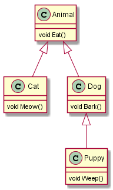

# Activity 1 Inheritance

## แนะนำ 
 ในการเขียนโปรแกรมจากคลาสไดอะแกรมนั้น เราต้องอ่านไดอะแกรมให้รู้และเข้าใจว่าไดอะแกรมบอกอะไรแก่เราบ้าง (รายละเอียดเหล่านี้จะเรียนในเรื่อง UML diagram แต่ในการทดลองจะแสดงไดอะแกรมอย่างง่าย ไม่ซับซ้อนมาก เพื่อให้เข้าใจตรงกันและให้เห็นวิธีการนำไดอะแกรมมาเขียนเป็นโปรแกรม)  

ให้พิจารณาไดอะแกรมในรูปที่ 1

 

__รูปที่ 1__ ไดอะแกรมของตัวอย่างสัตว์เลี้ยงในบ้าน

จากไดอะแกรมพบว่ามีคลาสจำนวน 4 คลาส และมีการสืบทอด โดนอธิบายได้ดังนี้
1. สัตว์ทั้งหมด มีความสามารถ Eat()
2. แมวร้อง Meow()
3. สุนัขเห่า Bark()
4. ลูกสุนัข เห่า Bark() และ ร้อง Weep()

การเขียน class ให้เริ่มเขียนจาก base class ตามด้วย derived class ตามลำดับการสืบทอดจนครบ

## การทดลอง
1. สร้าง Project เป็น Console project  ชื่อ Animal
2. เขียนคลาส Animal ไว้นอกคลาส Program ดังต่อไปนี้ 
``` C#
using System;
using System.Collections.Generic;
using System.Linq;
using System.Text;
using System.Threading.Tasks;

namespace Animal
{
    class Animal            // เพิ่ม class ชื่อ  Animal
    {
        public void Eat()   // เมธอด Eat()
        { 
           // ยังไม่ต้องเขียน Code         
        }
    }
    class Program
    {
        static void Main(string[] args)
        {
        }
    }
}
```
3. เพิ่ม derived class ที่ชื่อ `Cat` ไว้ด้านล่างคลาส animal โดยมีการสืบทอดมาจากคลาส Animal  (ดู Code ที่เสร็จแล้วได้จาก [คลิก ตัวอย่าง](Example/Animal/Animal/Program.cs))

```C#
    class Cat : Animal  
    {
        public void Meow()
        {

        }
    }
```
